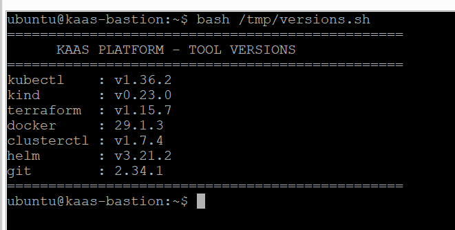
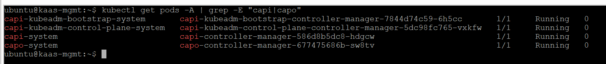
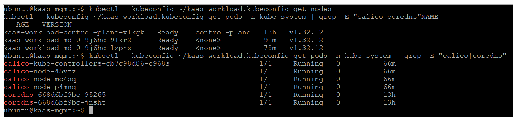

# KaaS on OpenStack — Kubernetes as a Service with Cluster API

> A production-grade self-service Kubernetes platform built on OpenStack using Cluster API (CAPI) + CAPO.
> One `kubectl apply` = one new Kubernetes cluster provisioned automatically on OpenStack.

## Architecture

- **Management cluster**: single-node Kubernetes bootstrapped with kubeadm on a dedicated VM
- **Cluster API (CAPI)**: declarative cluster lifecycle management
- **CAPO**: OpenStack infrastructure provider — creates VMs, networks, security groups automatically
- **Workload cluster**: 3-node Kubernetes cluster provisioned on demand

## Stack

| Tool | Version | Role |
|---|---|---|
| Cluster API (CAPI) | v1.10.10 | Declarative cluster lifecycle |
| CAPO | v0.10.4 | OpenStack infrastructure provider |
| kubeadm | v1.32.13 | Management cluster bootstrap |
| Calico | v3.28 | Pod networking (CNI) |
| Helm | v3.21 | Application deployment |
| clusterctl | v1.7.4 | Cluster API CLI |
| kubectl | v1.36.2 | Kubernetes CLI |

## Result — Workload Cluster

A fully working 3-node Kubernetes cluster provisioned automatically by applying one YAML file:
NAME                                STATUS   ROLES           VERSION

kaas-workload-control-plane-vlkgk   Ready    control-plane   v1.32.12

kaas-workload-md-0-9j6hc-9lkr2      Ready    worker          v1.32.12

kaas-workload-md-0-9j6hc-lzpnz      Ready    worker          v1.32.12

## Screenshots

## Deployment

See [docs/deployment.md](docs/deployment.md) for the full step-by-step guide.

## Author

**Zekkour Abderraouf** — Final year Networks, Systems & Telecommunications — ENSTICP Algiers
- GitHub: [@Abderraoufzekkour](https://github.com/Abderraoufzekkour)
- LinkedIn: [zekkour-abderraouf](https://www.linkedin.com/in/zekkour-abderraouf)
