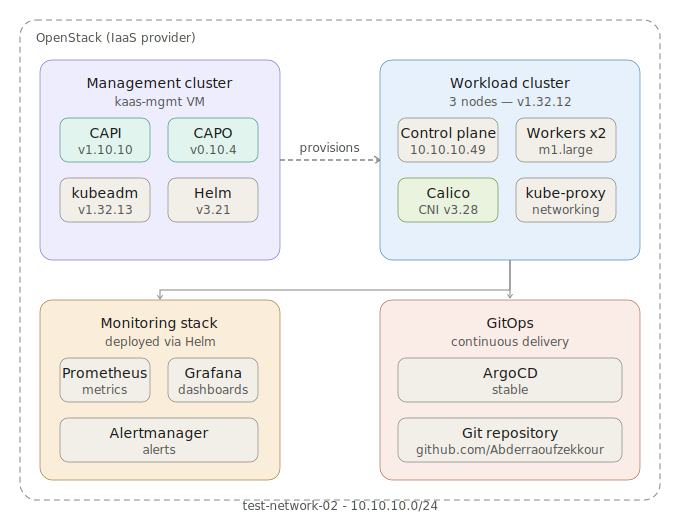
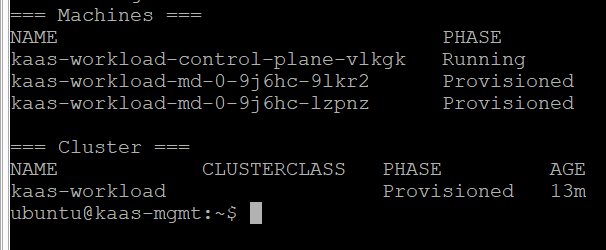
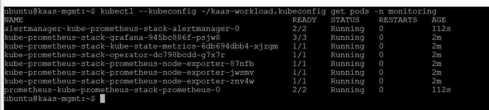
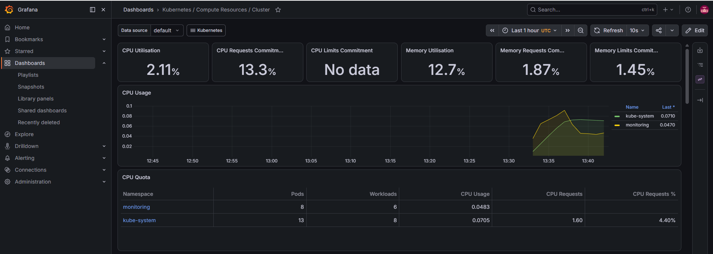
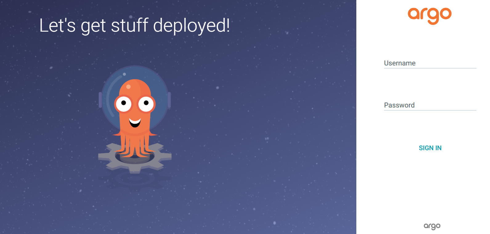

# KaaS on OpenStack — Kubernetes as a Service with Cluster API

> A production-grade self-service Kubernetes platform built on OpenStack using Cluster API (CAPI) + CAPO.
> One `kubectl apply` = one new Kubernetes cluster provisioned automatically on OpenStack.

## Architecture

## Stack

| Tool | Version | Role |
|---|---|---|
| Cluster API (CAPI) | v1.10.10 | Declarative cluster lifecycle management |
| CAPO | v0.10.4 | OpenStack infrastructure provider |
| kubeadm | v1.32.13 | Management cluster bootstrap |
| Calico | v3.28 | Pod networking (CNI) |
| Prometheus + Grafana | v0.78 | Monitoring and observability |
| ArgoCD | stable | GitOps continuous delivery |
| Helm | v3.21 | Application package manager |
| clusterctl | v1.7.4 | Cluster API CLI |
| kubectl | v1.36.2 | Kubernetes CLI |

## Result

A fully working 3-node Kubernetes cluster provisioned automatically by applying one YAML file:
NAME                                STATUS   ROLES           VERSION

kaas-workload-control-plane-vlkgk   Ready    control-plane   v1.32.12

kaas-workload-md-0-9j6hc-9lkr2      Ready    worker          v1.32.12

kaas-workload-md-0-9j6hc-lzpnz      Ready    worker          v1.32.12

## How it works

1. A management cluster runs CAPI + CAPO controllers on a dedicated VM
2. Applying `manifests/cluster-template.yaml` triggers CAPO to provision VMs on OpenStack
3. CAPO automatically creates the network, security groups, and bootstraps Kubernetes on each VM
4. The workload cluster is fully managed — scale, upgrade, delete with kubectl

## Screenshots

| | |
|---|---|
| CAPI controllers running |  |
| Workload cluster provisioned |  |
| Workload cluster ready |  |
| Prometheus + Grafana |  |
| Grafana dashboard |  |
| ArgoCD UI |  |

## Repository structure
.

├── manifests/

│   └── cluster-template.yaml   # CAPI cluster manifest template

├── docs/

│   ├── deployment.md           # Step-by-step deployment guide

│   └── troubleshooting.md      # Common issues and fixes

├── architecture/

│   └── architecture.svg        # Architecture diagram

└── screenshots/                # Project screenshots

## Deployment

See [docs/deployment.md](docs/deployment.md) for the full step-by-step guide.

## Troubleshooting

See [docs/troubleshooting.md](docs/troubleshooting.md) for common issues and fixes.

## Author

**Zekkour Abderraouf** — Final year Networks, Systems & Telecommunications — ENSTICP Algiers
- GitHub: [@Abderraoufzekkour](https://github.com/Abderraoufzekkour)
- LinkedIn: [zekkour-abderraouf](https://www.linkedin.com/in/zekkour-abderraouf)
